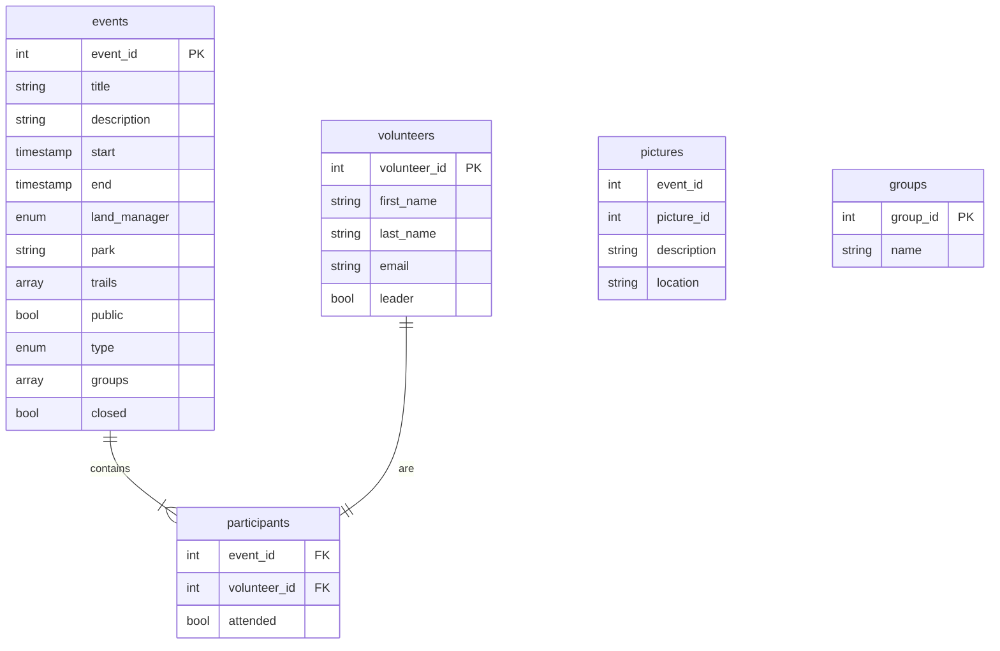

# Database

TRV uses Heroku Postgres

## Schema

```mermaid
erDiagram
    events ||--|{ participants: contains
    volunteers ||--|| participants: are
    events {
        int event_id PK
        string title
        string description
        timestamp start
        timestamp end
        enum land_manager
        string park
        array trails
        bool public
        enum type
        array groups
        bool closed
    }
    participants {
        int event_id FK
        int volunteer_id FK
        bool attended
    }
    volunteers {
        int volunteer_id PK
        string first_name
        string last_name
        string email
        bool leader
    }
    pictures {
        int event_id
        int picture_id
        string description
        string location
    }
    groups {
        int group_id PK
        string name
    }
```

## Migrations

TBD